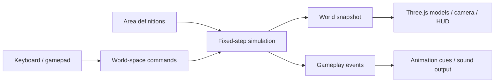

# Game architecture and development direction

Status: foundation implemented. Old Town Square and a coffee shop interior are
playable with a janitor, three splash-pad kids, carryable props, one objective, and a
hand-authored follow camera. Sight/hearing-based stealth, a rigid-body physics
engine, reactive piano, gates/shortcuts, and saved games are still future work.

## Product contract

Build a small, interconnected social-stealth sandbox about physical comedy. The
player succeeds by understanding people and manipulating their surroundings.
Being caught creates another situation to play through: a villager retrieves an
item, shoos the goose away, or temporarily guards an entrance. It must not kill the
goose, erase completed objectives, reset the neighborhood, or end the game.

The core loop is **observe a routine → improvise a distraction → manipulate an
object → provoke a readable reaction → exploit the opportunity → cross off a task**.
Walking through attractive scenery is the prologue, not proof of that loop.

Preserve the existing Canada goose, cel shading, and controls. The camera follows
hand-drawn per-area tracks (see [Camera](#camera)); change its rules deliberately,
not as a side effect of other work. Develop
original places, puzzles, characters, and recordings with the requested gameplay
qualities. Do not expand the village until one small garden proves the loop.

## What the repository supports today

| Area | Current implementation | Remaining constraint |
| --- | --- | --- |
| Gameplay ownership | `Simulation` owns the goose, world entities, the janitor, splash-pad kids, durable facts, and objective progress | NPC rules are hand-written per character, not a shared perception/intent system |
| Timing | 60 Hz simulation, bounded catch-up, retained honk edge | No replay format or cross-platform physics determinism promise |
| Input | Keyboard, gamepad, and touch become a world-space command: move, hurry, honk, interact, spread wings, sneak, threaten | Drag, throw, and mimic actions are not implemented |
| Entities | Authored props with stable IDs (for example `plaza.beer-can`); the goose and janitor share grab/drop rules; litter can be held inside the trash bag; a controller (the splash faucet) toggles a target | Capabilities are limited to carry, contain, and control; no drag, throw, open, or wear |
| People | The janitor follows an authored cleanup route, investigates the splash pad, chases and shoos the goose, fumbles when startled, and recovers his stolen tools; kids play, splash, flee a threatening goose, cry, and return | Noticing is distance-based: no field of view, line of sight, hearing, or last-seen memory yet; routes are authored waypoints, not navigation |
| Rendering | `Game` copies simulation snapshots into Three.js; `WorldView` renders an authored area; models are presentation | Views are rebuilt per area rather than streamed |
| Camera | Presentation-only follow camera: optional per-area sky tracks with ground zones, fixed diagonal fallback, janitor framing, steady held-direction controls | Tracks are authored by hand; the builder preview shows the settled pose, not the in-game glide |
| Collision | Renderer-independent colliders from the world asset catalog (`worldLevel.ts`); an `AuthoredPhysicsAdapter` spike offers 2D bodies, overlap, and sweep queries | No rigid-body engine, 3D bodies, or navigation mesh |
| World content | Data-driven areas and asset catalog (`worldLayout.ts`, `worldAssets.ts`), edited in the in-game builder (`?edit`) and saved as a browser draft or exported JSON | Only two areas; the legacy forest (`bramble.ts`) and plaza-only formats remain for reference and migration |
| Objectives | Independent predicates with stable IDs, completed once; "Sneak into the coffee shop" completes from a durable fact while the janitor is not guarding the door | Only one task; the to-do list shows every task at once |
| Progression | Doorway transitions move between the square and the coffee shop, carrying durable facts and each area's object state | No unlockable gates or shortcuts yet |
| Sound | Honk and footstep sounds from a separate browser audio output with one reusable context | No music director, piano assets, or spatial sound yet |
| Persistence | Session state survives area changes; the authored world layout persists in browser storage | Reloading resets gameplay; no save/load implementation |

`src/` is the active browser game. Godot files and `legacy/phaser-prototype/` are
reference experiments. Do not develop the same feature in multiple runtimes.

## Boundaries that prevent expensive rewrites

This diagram represents the implemented boundary. As the garden grows, physics,
perception, NPC decisions, interactions, objectives, and progression run **inside**
the simulation. Persistence and the music director become adapters around it.
Avoid a second set of gameplay rules in animation callbacks, DOM handlers, or
mesh names. A headless simulation must be able to resolve the same puzzle.

Keep concrete modules and typed data. A full entity-component framework, general
event bus, and network synchronization are not prerequisites. The in-game world
builder authors content data only; it does not add gameplay rules. Introduce an
abstraction when a real garden mechanic needs the boundary.

### Tick order and events

The current tick moves the goose, emits a honk event, updates the splash-pad kids
and the janitor, records durable facts from objective zones, then evaluates
objectives and doorway transitions. The garden should extend that order explicitly:

1. Consume player commands and NPC intents decided on the previous tick.
2. Resolve valid actions and ownership changes, then advance physical bodies.
3. Derive contacts, overlaps, noise, visibility, and each human's observations.
4. Update human memories/awareness and choose intents for the next tick.
5. Evaluate objective predicates against settled state, then apply unlock rules.
6. Expose the snapshot and this tick's events to presentation and music.

Commands request actions; events describe actions that actually happened. A denied
grab must not emit an item-grabbed flourish or complete a theft task. Events carry
stable actor/object IDs and relevant positions. Do not use an event history as the
only record of durable world facts. A completed task is state; its notification
is a one-time event. Keep queues bounded and presentation disposable.

The fixed-step loop retains a honk on a render frame without a simulation tick
and consumes it once during catch-up. Pausing clears pending inputs and time,
preserving progress. Cap stalls instead of simulating minutes of chases on tab
return. Input replays, if added, must record commands per simulation tick. The
player view interpolates previous/current fixed-step transforms using the
remaining tick fraction; these read-only samples never feed back into physics.
Player animation uses Blender clips with presentation-only phase/blend state and
head tracking. Resolved events trigger one-shots; animation never resolves actions.

### Camera

The camera is presentation. It reads the simulation snapshot but never changes
gameplay: framing a nearby character changes what the player sees, not what that
character knows or does.

- **Tracks.** An area may define `cameraTracks`: each is hand-placed points
  (position and zoom) joined into a smooth curve. The camera slides along the curve to the spot
  nearest the goose and looks at it, so bends swing the view around corners. It
  searches only the stretch of track near where it already is, so it never jumps
  between distant stretches. Areas without a track use the fixed diagonal camera.
- **Zones.** A track may own a zone, a shape drawn on the ground. While the goose
  is inside it, that track is used; the track without a zone covers everywhere
  else. The camera keeps a zone's track until the goose is a little way outside
  it, and glides between tracks over about a second instead of cutting.
- **Reach.** When the goose is more than a set horizontal distance from the track,
  the camera keeps the track's height and viewing direction but leans in toward
  the goose. Author tracks beside walking routes, not directly above them.
- **Framing.** When the janitor is near, the camera aims between him and the goose;
  it lets go, with hysteresis, before he would reach the edge of the frame.
- **Controls.** Movement is camera-relative, but a held direction keeps the heading
  it started with while the view swings. Releasing the stick or clearly choosing a
  new direction adopts the current view.
- **Authoring.** Tracks and zones are edited in the builder's "Edit camera tracks"
  mode and saved with the area. The logic lives in `cameraTrack.ts`,
  `cameraDirector.ts`, `cameraFraming.ts`, and
  `controlHeading.ts` and is covered by headless tests.

### One world and stable object identity

World entities are keyed by authored IDs such as `plaza.beer-can` and
`plaza.street-janitor`; future content follows the same pattern (`garden.thermos`,
`garden.north-gate`). Render meshes and physics handles map to these IDs; neither
owns their identity.

Separate immutable content definitions from mutable state. An object definition
describes shape, mass, grip points, affordances, appearance, and home location.
Its state records current transform, velocity, holder, containment, and condition.
Legal ownership is distinct from the actor currently holding it. A human and the
goose cannot both acquire the same item in a tick; one interaction resolver
arbitrates all acquisition/release operations deterministically.

Areas describe geography and content placement. They do not own disposable copies
of the world's objects. Crossing an area boundary updates location without
recreating the goose or carried objects. Today one area is simulated at a time:
the session carries durable facts and a per-area snapshot of entity state across
each doorway so dropped and carried objects keep their identity. Move toward the
small village loaded together. If streaming later becomes necessary, stream visual assets separately
from authoritative state; held objects, nearby physics, and active pursuits stay
resident. Never respawn an authored object just because its home area reloads.

### Interaction and physics

Use capabilities such as carryable, draggable, throwable, containable, openable,
wearable, and noise-producing. Compose them per prop; don't subclass every puzzle
item or scatter checks like `if item.name === "thermos"` throughout the engine.
Objectives may target a specific authored object, but generic verbs must work on
every compatible object.

Before producing many props, run a physics spike behind a narrow adapter (started
in `simulation/physics.ts` as a 2D ground-plane `AuthoredPhysicsAdapter`): body
creation/removal, fixed stepping, constraints, impulses, overlap/sweep/line queries,
and stable body-to-entity mapping. Select an actual rigid-body engine by testing
the scenarios below in the browser. The current collision helper does not supply
physics, and Three.js rendering is not a substitute for it. Retain the option to
move runtime if this spike demonstrates an unsuitable browser performance or
authoring workflow; make that decision before large content investment.

Treat the goose and walking humans as controlled character bodies. Give small
props physical bodies, friction, mass, and collision shapes independent of their
render geometry. Carrying uses a controlled grip constraint/target; dragging uses
a tether with ground contact; dropping releases; throwing applies a bounded
impulse. Use appropriate swept collision for fast objects. Keep a low, clumsy toss
that supports puzzles and comedy, with no damage system.

The first spike must demonstrate a mug resting on a table, an item dragged through
a narrow gate, carrying around a corner without clipping walls, a toss that hits
an obstacle, release during a shoo reaction, and a human retrieving the same item.
Also test tipping, containers, and multiple interacting objects. If these do not
work reliably, stop and fix interaction/physics before building more scenery.

### Human knowledge and social stealth

Physics queries answer what can be seen or heard; the AI remembers only its own
observations. Give each villager a routine, interests/home objects, personal
space, field of view, hearing parameters, last-seen position/time, and a bounded
search. A simple state machine is enough initially:

`routine → notice → investigate → shoo/chase or retrieve → search → return`

Check distance, facing, and occlusion before visual detection. Track awareness
over time with separate acquisition/loss thresholds so reactions do not flicker
at hedge edges. Honks and collisions produce positional noise: a human can turn
toward a hidden noise without knowing the goose's exact current location. Losing
sight preserves the last seen location, not live tracking through walls.

Movement collision, navigation, sight blocking, sound attenuation, and hiding
cover are separate authored properties. A low bush can conceal the goose while
allowing passage; a fence can stop walking while allowing sight. An open gate
changes traversal and occlusion together. Visual hedges must agree with authored
sight-blocking geometry. Add a development overlay for colliders, paths, vision
cones, last-seen locations, hearing events, and awareness values during this work.

Navigation must route around fences and respect gate width and agent size. A human
searches reachable places and eventually returns to routine; a chase cannot
deadlock at a gate forever. NPCs use the same grab/release rules as the player.
Mimicry is an observable action or pose that a particular NPC recognizes, routed
through this perception/reaction system rather than a task-specific cutscene.

Being caught may release a held item, move the human into the goose's path, or
cause a brief retreat. Completed tasks and unlocked shortcuts remain completed.
Never solve an AI failure by globally resetting the world. Object recovery should
restore only an unreachable essential item to a safe location when no actor holds
it, with no duplication and no task rollback.

### To-do list and shortcuts

Objectives observe **outcomes**, not a mandatory sequence of button presses. For
example, an item is inside a basket, or a gardener has worn an object. A task about
simultaneous placement must verify all required items coexist in the container;
historical visits alone are insufficient. A task about a past occurrence needs an
explicit durable fact recorded when the occurrence happens.

Extend the current predicate input from `PlayerState` to a read-only world snapshot
as entities arrive. Keep all independent tasks eligible on each update. Add a real
list UI before adding multiple tasks. Separate list visibility from eligibility
so an unlisted task can still count when the player discovers its solution early.
Use prerequisites only where the puzzle physically requires them.

Unlock rules observe completed objective IDs and update a specific gate/shortcut.
Do not have the UI open gates, let an objective teleport items, or let crossing an
exit destroy the current area. An unlocked route must allow backtracking and item
transport. Keep quest-related object references global across neighborhoods.

### Reactive music

Do not build the score around constant background playback or player speed alone.
House House describes selecting between recorded high/low-energy piano fragments
and silence according to the action. The claim that the original uses no
prerecorded music is incorrect. The specific rule “every stop immediately silences
the piano” is not a requirement established by that explanation.

Source: [Panic's interview with House House](https://podcast.panic.com/episodes/s01e01/transcript/).

Add a music director that reads the same awareness states as NPC behavior plus
confirmed action events. It requests quiet, curious, or chase phrases and brief
action accents; the audio output schedules them. Use one audio context, cached
recordings, phrase-boundary transitions, short fades, a maximum voice count, and
cooldowns to avoid a flourish on every tick. Choose tempo/intensity through the
recordings and their metadata rather than blindly speeding up audio and changing
pitch. Allow silence as an intentional state after tension resolves. Stopping
while still being pursued should not falsely signal safety.

Define how several observers combine (initially the highest nearby engagement),
with hysteresis and a release delay. Unrelated activity across the village should
not dominate the local score. NPC gestures and posture must still communicate
awareness when music is muted. Provide separate music/effects volume controls
when music is added. Use original or appropriately sourced recordings; no piano
assets are included in this foundation.

### Persistence and recovery

Before the second neighborhood, implement a versioned save snapshot of entity IDs,
transforms, ownership/containment, gate state, objective completion, durable facts,
NPC routine/memory state needed for continuity, and seeded random state. Serialize
plain data, not scene graphs, audio nodes, or physics handles. Define migrations
and behavior for missing content IDs. Validate one holder per item on load.

Restore state before evaluating objectives, suppress repeated completion cues on
load, then rebuild views/physics. Test save/load while carrying an item across a
gate and after an NPC has moved it from its original home. Pause and reload are
different operations. Until saves exist, the game is explicitly session-only.

## Development sequence and exit criteria

Milestone 1 is done. The team then built Old Town Square rather than a single
garden, so parts of milestones 2 and 3 exist there in an early form (carryable
props, the physics adapter spike, a janitor routine with shooing, and one task).
The garden gates below still apply before expanding further.

1. **Foundation (done).** Separate simulation from views, fix gameplay time,
   keep objective evaluation independent, separate audio output, and remove the
   terminal trail state. Headless regression tests pass alongside the old tests.
2. **One garden: physical interactions.** One table, one fence/gate, one container,
   one bush, and several small props. Prove the physics spike and common player/NPC
   interaction rules. Do not polish a whole village during this milestone.
3. **One garden: a person and mischief.** One gardener with a routine, vision,
   hearing, investigation, retrieval, search, and shooing. Add a small to-do list
   with three independent tasks. Include an original distraction/theft task, an
   object arrangement task, and an observable mimicry task. Each task should admit
   improvised timing or placement rather than require a scripted solution.
4. **One garden: audio and recovery.** Add a small authored piano phrase set,
   awareness-based music, readable silent-mode reactions, safe item recovery, and
   save/load. Playtest the complete loop and revise it before adding another area.
5. **Second connected neighborhood.** Unlock a physical shortcut, carry a prop
   across it, let a human retrieve it, revisit the garden, and reload the save.
   Expand only after identity, progress, navigation, and performance hold up.

## Acceptance scenarios before village expansion

- Complete the three tasks in different orders. Allow two to complete on one tick
  and completion before the list is viewed. No duplicates or revoked checkmarks.
- Solve one task through at least two different action sequences or placements.
  An alternate solution requires no new task-specific interaction code.
- Hide behind the bush; the gardener loses sight, searches the last observed place,
  and returns to routine. Honking from cover causes investigation, not omniscience.
- Distract the gardener, steal a prop, get caught, and try again immediately. The
  item remains unique, the world persists, and completed tasks remain completed.
- Carry, drag, and toss compatible props through the same interaction system used
  by the gardener. Invalid grabs produce neither ownership changes nor success cues.
- Carry a red thermos through a shortcut and back. It remains the same object after
  a save/load; its original spawn does not create a duplicate.
- Hear quiet/engaged/chase transitions from actual human awareness. Breaking sight
  and resolving a search allows silence; a stationary goose under pursuit does not
  make the soundtrack report safety. Muting still leaves readable visual reactions.
- Run at 30, 60, and 144 render FPS, pause mid-interaction, and return from a stalled
  tab. Commands are not repeated, actors do not tunnel or explode, and progress
  persists. Profile target hardware before increasing active body/NPC counts.

These garden scenarios are future acceptance gates, not claims that Old Town
Square passes them. Headless tests in `tests/` cover the simulation, janitor and
kid behavior, interactions, the coffee shop, world layout and migrations, the
camera logic, and asset metadata; browser playtesting and the garden systems
remain to do.
